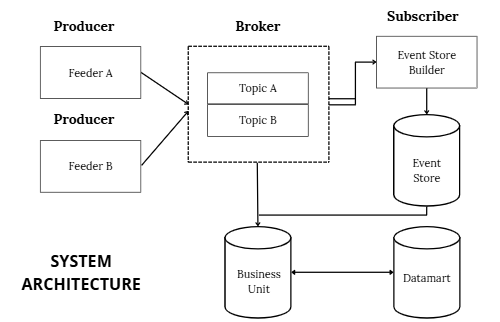
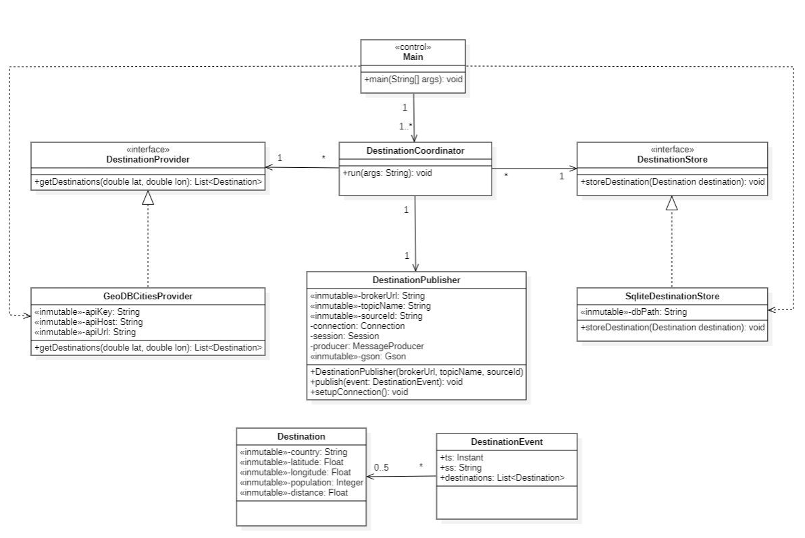
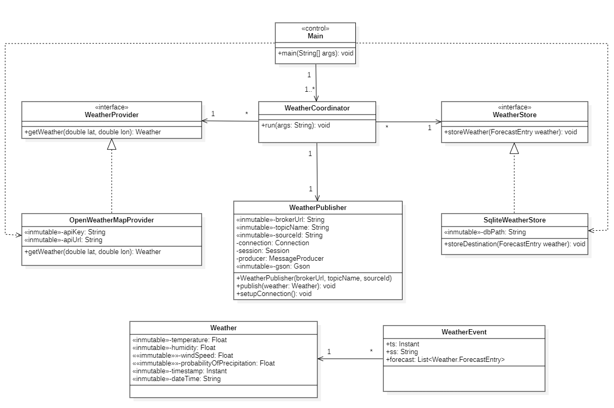

<table>
<tr>
<td>
  
</td>
<td>
  <h1>Final Project</h1>
  <h2>Travel Recommender System Based on Weather</h2>
</td>
</tr>
</table>

- **Subject:** Data Science Application Development (DACD)
- **Academic Year:** 2025-2026
- **Degree:** Data Science and Engineering (GCID)
- **School:** School of Computer Engineering (EII)
- **University:** University of Las Palmas de Gran Canaria (ULPGC)

# Main Functionality

This project implements a modular architecture for the acquisition, storage, and exploitation of weather and geographic data. Over the course of three sprints, four Java modules have been developed that work together through a messaging system based on Apache ActiveMQ.

In Sprint 1, two feeders were built to retrieve up-to-date information from external APIs and store it locally. In Sprint 2, real-time event exchange was introduced, allowing data to be published and stored in a structured manner in files organized by date and source. Finally, in Sprint 3, a business unit was developed to consume these data both in real time and from historical records, providing the end user with query, analysis, and recommendation functionalities through a command-line interface.

The system automates the entire data lifecycle and demonstrates how to design scalable solutions aimed at decision-making in real-world scenarios.

# Resources Used

- **Development Environment:** IntelliJ IDEA.
- **Version Control Tools:** Git, GitHub
- **Dependency Management:** Maven
- **Programming Language:** Java 21
- **Messaging System:** Apache ActiveMQ 5.15.12

# Project Architecture

The project is organized into four independent modules that reflect the development phases of each sprint, following a modular architecture and the Publisher/Subscriber pattern with a clear separation of responsibilities. The APIs used were selected based on their accessibility and quality: the GeoDB Cities API offers global coverage and advanced filtering by country and population, while OpenWeatherMap provides detailed and up-to-date weather forecasts in real time. Additionally, a hybrid datamart structure was designed to enable both real-time processing and deferred analysis, combining the use of SQLite for local persistence during ingestion and an event store organized chronologically and hierarchically by topic and source.

## System Architecture

The following diagram illustrates the overall system architecture: the `feeder` modules act as producers, sending events through the ActiveMQ broker. The `event-store-builder` consumes and stores them, while the `business-unit` accesses data both in real time and from the datamart for further analysis.



## Application Architecture

Below are the internal components of each module, including their packages, main classes, and UML diagrams. This structure reflects a clean, maintainable implementation aligned with SOLID principles.

### `destination-feeder`

**Main Function:**  
Retrieves up-to-date geographic information from the [GeoDB Cities API](https://rapidapi.com/wirefreethought/api/geodb-cities/), stores it locally in SQLite, and publishes it as events to the broker.

**Packages and Classes:**

- **control**
   - `DestinationCoordinator`: Main class for orchestrating the module’s flow; coordinates data loading, storage, and publishing.
   - `DestinationProvider`: Handles retrieval of destinations from the external API using filters like country and population.
   - `DestinationPublisher`: Encapsulates and publishes destination data as events to ActiveMQ.
   - `DestinationStore`: Interface that defines how destinations are stored locally.
   - `GeoDBCitiesProvider`: HTTP client responsible for interacting with the GeoDB Cities API.
   - `SqliteDestinationStore`: Implements `DestinationStore`, storing data in SQLite.

- **model**
   - `Destination`: Represents the key attributes of a city/destination.
   - `DestinationEvent`: Structures destination data into JSON event format.

- **main**
   - `Main`: Entry point of the module; sets parameters and executes the full data flow.



---

### `weather-feeder`

**Main Function:**  
Queries the [OpenWeatherMap API](https://openweathermap.org/api) to obtain weather forecasts, stores them in SQLite, and publishes them as structured events.

**Packages and Classes:**

- **control**
   - `WeatherCoordinator`: General controller managing the entire process of the module.
   - `WeatherProvider`: Retrieves weather forecasts from OpenWeatherMap.
   - `WeatherPublisher`: Publishes weather events in JSON format to the broker.
   - `WeatherStore`: Interface for defining local weather data storage.
   - `OpenWeatherMapProvider`: HTTP client that interacts with the OpenWeatherMap API.
   - `SqliteWeatherStore`: Implements `WeatherStore`, persisting data in SQLite.

- **model**
   - `Weather`: Represents weather conditions for a city at a specific timestamp.
   - `WeatherEvent`: Encapsulates weather data in JSON event format.

- **main**
   - `Main`: Main class that launches the feeder using specified arguments.



---

### `event-store-builder`

**Main Function:**  
Consumes real-time events from ActiveMQ and stores them in structured files organized by topic, source, and date.

**Package and Classes:**

- **control**
   - `EventProcessor`: Processes, deserializes, and organizes received messages.
   - `EventStoreBuilder`: Main class responsible for initialization and subscription management.
   - `EventSubscriber`: Listens to relevant events on ActiveMQ.
   - `EventWriter`: Writes events to the filesystem under the structure:  
     `eventstore/{topic}/{ss}/{YYYYMMDD}.events`

---

### `business-unit`

**Main Function:**  
Accesses both historical and real-time event data to perform analysis, queries, and recommendations through a console-based interface.

**Packages and Classes:**

- **control**
   - `Main`: Entry point for the business unit; orchestrates different types of user queries.

- **model**

- **view**

# Build and Execution Instructions

## Run from IntelliJ

To run this project from IntelliJ IDEA, follow these steps:

### 1. Download the source code
Download the `.zip` file of the project and unzip it in your preferred location on your system.

### 2. Open the project in IntelliJ
From IntelliJ IDEA, select **"Open"** and navigate to the root folder of the unzipped project.

### 3. Configure the run arguments
Each module requires specific arguments to run properly. These must be set in the **Run/Debug Configurations** section in IntelliJ.

- **For `destination-feeder`:**
  ```bash
  <api_key> <db_path> <lat> <lon> <broker_url> <topic_name> <source_id>
  ```

- **For `weather-feeder`:**
  ```bash
  <api_key> <db_path> <lat> <lon> <broker_url> <topic_name> <source_id>
  ```

- **For `event-store-builder`:**
  ```bash
  <broker_url> <topic1,topic2>
  ```

- **For `business-unit`:**
  ```bash

  ```

### 4. Make sure ActiveMQ is running

This project relies on a messaging broker. Apache ActiveMQ must be installed and running locally.  
You can get more information and download it from [https://activemq.apache.org/getting-started](https://activemq.apache.org/getting-started).

**Tip**: Once installed, you can start the broker using:

  ```bash
    ./bin/activemq start
  ```

And access the web console at: http://localhost:8161/ (default user, password)

### 5. Run the modules

Click the run button next to the `main()` method of each module.  
Execute the modules in the following order:

1. `event-store-builder`
2. `destination-feeder`
3. `weather-feeder`
4. `business-unit`

## Run from Terminal

To run this project using the generated JAR files from the terminal, follow these steps:

### 1. Prerequisites
- Ensure you have the **Java Development Kit (JDK)** installed.
- Install and run **Apache ActiveMQ** locally.  

### 2. Download the JAR files
Build the project or obtain the precompiled JARs for each module. You should have four JARs corresponding to:
- `destination-feeder`
- `weather-feeder`
- `event-store-builder`
- `business-unit`

### 3. Prepare required arguments
Before launching each module, identify and prepare the necessary arguments:

- **For `destination-feeder`:**
  ```bash
  java -jar destination-feeder-1.0-SNAPSHOT-jar-with-dependencies.jar <db_path> <country> <min_population> <limit> <broker_url> <topic_name> <source_id>
  ```

- **For `weather-feeder`:**
  ```bash
  java -jar weather-feeder-1.0-SNAPSHOT-jar-with-dependencies.jar <db_path> <lat> <lon> <broker_url> <topic_name> <source_id>
  ```

- **For `event-store-builder`:**
  ```bash
  java -jar event-store-builder-1.0-SNAPSHOT-jar-with-dependencies.jar <broker_url> <topic1,topic2>
  ```
  
- **For `business-unit`:**
  ```bash

  ```

### 4. Execute the modules

Open a terminal for each module and run them in the following order:

1. `event-store-builder`
2. `destination-feeder`
3. `weather-feeder`
4. `business-unit`

**Note:** Each module runs as a continuous service. Use separate terminals so that all modules can run simultaneously.

### SOLID Principles

This application follows SOLID principles to ensure modularity, flexibility, and maintainability across all modules.

- **Single Responsibility Principle (SRP):**  
  *Example:* The `DestinationPublisher` class (`destination-feeder`) is solely responsible for converting destination data into JSON messages and sending them to the ActiveMQ broker. It does not manage filtering or data persistence.

- **Open/Closed Principle (OCP):**  
  *Example:* The `WeatherProvider` interface (`weather-feeder`) allows new providers to be added without modifying the logic in `WeatherCoordinator`, making the module easily extensible.

- **Liskov Substitution Principle (LSP):**  
  *Example:* The `SqliteDestinationStore` class (`destination-feeder`) can replace any implementation of the `DestinationStore` interface without affecting the behavior of `DestinationCoordinator`.

- **Interface Segregation Principle (ISP):**  
  *Example:* The `EventProcessor` interface (`event-store-builder`) contains only the methods necessary for processing events, avoiding forcing implementers to depend on unused functionality.

- **Dependency Inversion Principle (DIP):**  
  *Example:* In the `event-store-builder` module, the `EventProcessor` and `EventWriter` abstractions are injected into the business logic instead of using concrete classes, promoting loose coupling and testability.

# Participants:

* **Suárez Sauca, Carlos** - [CarlosSuaSau](https://github.com/CarlosSuaSau)
* **Casimiro Torres, Kimberly** - [Kimberlycasimiro](https://github.com/Kimberlycasimiro)
